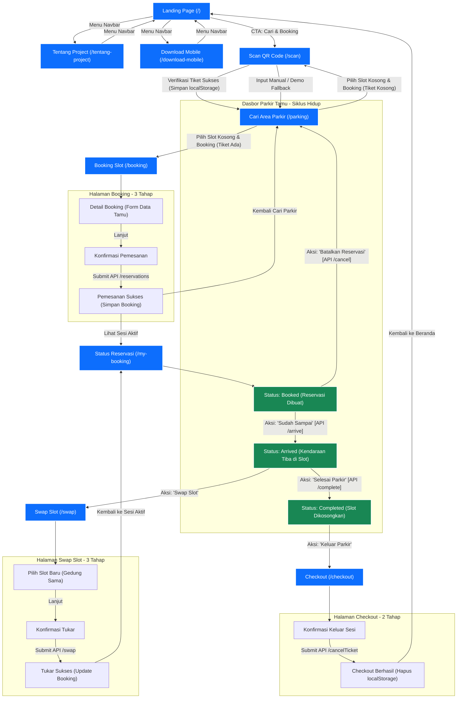

# Diagram Navigasi Antarmuka (Navigation Diagram) — ParkFinder Web User

Dokumen ini memetakan diagram alur navigasi antarmuka (User Interface Navigation Flow) dari aplikasi **ParkFinder Web User**. Diagram ini dimodelkan menggunakan format **Mermaid Diagram** dan menggambarkan secara akurat perjalanan pengguna (User Journey) dari landing page hingga sesi parkir berakhir.

---

## Diagram Alur Navigasi

---

## Penjelasan Alur Logika Navigasi

1.  **Akses Awal (Landing Area)**:
    Pengguna tamu masuk melalui `Landing Page (/)`. Pengguna dapat menjelajahi halaman informasi (`/tentang-project`) dan halaman download (`/download-mobile`). Untuk mulai memesan parkir, pengguna diarahkan memindai tiket terlebih dahulu di `/scan`.
2.  **Verifikasi Tiket (`/scan` ke `/parking`)**:
    Sesi parkir tamu membutuhkan tiket parkir fisik/digital dari gerbang. Di halaman `/scan`, kamera memverifikasi tiket dan menyimpan `guestSessionId` ke penyimpanan lokal (`localStorage`). Setelah sukses, pengguna otomatis dibawa ke `/parking`.
3.  **Reservasi Slot (`/parking` ke `/booking`)**:
    Di `/parking`, pengguna melihat slot kosong secara real-time. Setelah slot dipilih, jika tiket terdeteksi aktif, aplikasi mengarahkan ke `/booking` untuk pengisian data kendaraan tamu. Reservasi dibentuk setelah submit formulir konfirmasi ke backend.
4.  **Dasbor Kendaraan (`/my-booking`)**:
    Setelah booking sukses, pengguna diarahkan ke `/my-booking`. Di sini, siklus hidup parkir dikendalikan secara mandiri oleh pengguna tamu:
    *   **Booked**: Slot dipesan untuk plat kendaraan tamu. Begitu sampai di depan slot, tekan **Sudah Sampai** untuk mengubah status ke **Arrived**. Jika batal datang, tekan **Batalkan Reservasi** untuk melepas slot.
    *   **Arrived**: Kendaraan sedang parkir di dalam slot. Pengguna dapat memilih **Swap Slot** jika ingin pindah tempat, atau menekan **Selesai Parkir** ketika hendak pergi guna membebaskan slot di server.
    *   **Completed**: Kendaraan sudah keluar slot namun masih di area gedung. Pengguna diarahkan menekan **Keluar Parkir** untuk checkout tiket.
5.  **Checkout (`/checkout` ke `/`)**:
    Di `/checkout`, pengguna melakukan penonaktifan tiket parkir melalui gerbang keluar. Begitu dikonfirmasi, data tiket di localStorage dibersihkan, dan sesi tamu dinyatakan berakhir. Pengguna dikembalikan ke `/` (Landing Page).
